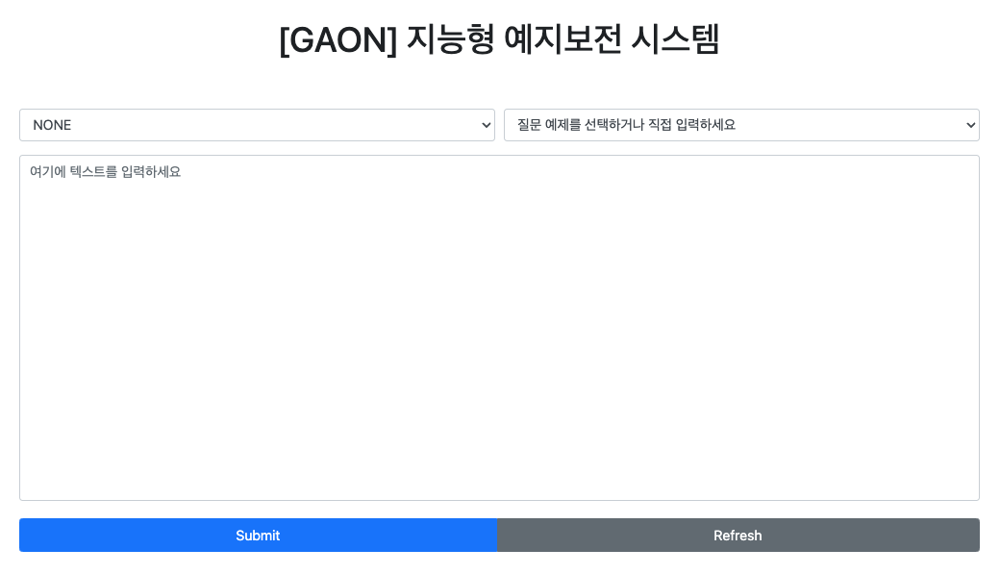

# Manual [GAON LLM]

## 목차

* [1.개요](#1.-개요)
* [2. 시스템 기능 정의](#2-시스템-기능-정의)

  + [2.1 Architecture](#21-Architecture)
  + [2.2 Chunking](#22-Chunking)
  + [2.3 LLM](#23-LLM)
  + [2.4 Demo](#24-Demo)
* [3. 통합 라이브러리 설치](#3-통합-라이브러리-설치)
* [4.Chunking](#4-Chunking)
  * [4.1 hwp2md](#41-hwp2md)
  * [4.2 base_chunking](#42-base_chunking)
  * [4.3 Font_based_chunking](#43-Font_based_chunking)
* [5.LLM](#5-LLM)
* [6.Demo](#6-Demo)

<div style="page-break-after: always;"></div>

## 1. 개요

   GAON-LLM은 계약연구센터(가온플랫폼, 고려대)에서 개발한 한국어 대규모 언어 모델 프레임워크로, SaaS LLM(Software-as-a-Service based on Large Language Models) 또는 LLM 납품을 위한 원천기술 연구를 목표로 함. 사용환경 및 설치 방법은 [다음](#3-사용-환경)과 같습니다.


## 2.  Architecture


## 3. 통합 환경 및 라이브러리 설치

   GAON-LLM의 다양한 기능을 활용하기 위해 필요한 모든 필수 라이브러리를 설치하는 과정입니다. 각 기능을 원활하게 실행할 수 있도록 문서 청킹, LLM의 학습 및 실행, 그리고 DEMO 시스템 구현에 필요한 모든 라이브러리가 담겨 있습니다. 보다 자세한 라이브러리 목록은 [Link]()에서 확인할 수 있습니다.

- OS : ubuntu 22.04
- Lang : `python3.8`
- CUDA_Versioin: 12.3

#### 시스템 사양 
- 학습: A6000 GPU(48G) 8장  
- 추론(데모): A6000 GPU(48G) 1장


##### 가상환경 설정

```shell
$ conda create -n gaon python=3.8

$ conda activate gaon
```

##### 라이브러리 설치


~~~shell
(gaon)$ pip install -r requirements.txt
~~~


## 4. Chunking

### 4.1 hwp2md

   데이터를 html파일로 변환해주는 모듈. 해당 모듈을 기반으로 base_chunking을 수행

#### Docker 이미지 빌드

- 도커 이미지 생성

  프로젝트의 루트 디렉토리에서 아래 명령어를 실행하여 `./Chunking/hwp2md` 디렉토리 안의 Docker 이미지를 빌드합니다.

  ```shell
  docker build -t hwp2md ./Chunking/hwp2md
  ```

#### 사용

- hwp2html

    HWP 파일을 읽어서 HTML 파일로 변환합니다.
    ```shell
    docker run -it --rm \
        -v $(pwd)/[입력 파일 경로]:/usr/src/app/input.hwp \
        -v $(pwd)/[출력 디렉토리 경로]:/usr/src/app/output/ \
        hwp2md hwp2html input.hwp [출력 디렉토리 경로]/[출력 파일 이름]
    ```

    - 예시) Chunking/hwp2md/src/MOA_MOB.hwp를 output/output.html로 변환
    ```shell
    docker run -it --rm \
        -v $(pwd)/Chunking/hwp2md/src/MOA_MOB.hwp:/usr/src/app/input.hwp \
        -v $(pwd)/output:/usr/src/app/output/ \
        hwp2md hwp2html input.hwp output/output.html
    ```

- html2md

    HTML 파일을 읽어서 MD 파일로 변환합니다.
    ```shell
    docker run -it --rm \
        -v $(pwd)/[입력 파일 경로]:/usr/src/app/input.html \
        -v $(pwd)/[출력 디렉토리 경로]:/usr/src/app/output/ \
        hwp2md html2md input.html [출력 디렉토리 경로]/[출력 파일 이름].md
    ```

    - 예시) output/output.html을 output/output.md로 변환
    ```shell
    docker run -it --rm \
        -v $(pwd)/output/output.html:/usr/src/app/input.html \
        -v $(pwd)/output:/usr/src/app/output/ \
        hwp2md html2md input.html output/output.md
    ```


### 4.2 base_chunking

   html 파일을 페이지별로 분할한 뒤, 이를 기반으로 Semantic 기반 Chunking을 수행

```h

```


### 4.3 Font_based_chunking

 Font size를 기반으로 문서를 구조적으로 분석해 Chunking을 수행

```
```


<div style="page-break-after: always;"></div>


## 5. LLM

본 섹션에서는 Instruction Tuning과 Inference 과정을 설명합니다.


### 5.1 Instruction-Tuning

Instruction Tuning은 LLM의 성능을 최적화하는 데 중요한 역할을 하는 과정입니다. 구축된 데이터를 이용하여 모델이 특정 작업에 맞게 조정될 수 있도록 합니다. 아래의 명령어는 `meta-llama/Llama-3.1-8B-Instruct` 모델을 활용한 Instruction Tuning의 예시입니다:

```python


LR=2e-5 # 5e-06

CUDA_VISIBLE_DEVICES=0,1,2,3,4,5,6,7 torchrun --nproc_per_node=8 finetune.py \
    --base_model "meta-llama/Llama-3.1-8B-Instruct" \
    --output_dir "./ckpt/llama3" \
    --vram_available "48GB" \
    --per_device_train_batch_size 1 \
    --gradient_accumulation_steps 1 \
    --num_epochs 5 \
    --learning_rate $LR \
    --cutoff_len 4096 \
    --warmup_steps 100 \
    --logging_steps 1 \
    --add_eos_token True\
    --bf16 \
    --save_steps 50\
    --eval_steps 50\
    --save_total_limit 4\
    --data_path "./dataset/training.jsonl"   
```

Learning Rate, batch_size, epoch 등 다양한 하이퍼파라미터를 조정하여 모델을 미세 조정할 수 있습니다.


### 5.2 Inference

Inference 단계는 훈련된 모델을 실제로 적용하여 질의에 대한 응답을 생성하는 과정입니다. 이것은 모델이 학습한 내용을 토대로 새로운 텍스트를 생성하는 단계로, 사용자는 아래의 예시를 통해 쉽게 응용할 수 있습니다:

```python
from transformers import AutoTokenizer, pipeline
import torch

model_and_tokenizer_path = "{model_path}"
tokenizer = AutoTokenizer.from_pretrained(model_and_tokenizer_path)

pipeline = pipeline(
    "text-generation",
    model=model_and_tokenizer_path,
    tokenizer=tokenizer,
    model_kwargs={"torch_dtype": "auto"},
    device="cuda:0",
)


#chat_template
# messages = [
#     {"role": "user", 
#      "content": "이순신 장군이 누구야?"},
# ]
# prompt = tokenizer.apply_chat_template(messages, tokenize=False, add_generation_prompt=True) # Don't use `pipeline.tokenizer`


#W/O chat_template
prompt='이순신 장군이 누구야?'

outputs = pipeline(
    prompt,
    max_new_tokens=1028,
    add_special_tokens=True
)

print(outputs[0]["generated_text"][len(prompt):]) # '이순신 장군은 조선 시대의 장군으로 임진왜란 당시 조선의 수군을 이끌고 일본의 공격으로부터 보호한 인물입니다.마침내 이순신 장군은 1592년에 조선 수군을 이끌고 일본의 공격으로부터 보호하는 데 성공했습니다.'
```


## 6. DEMO

이 문서는 GAON-LLM 프로젝트의 DEMO 시스템에 대한 구성 요소 및 실행 지침을 설명합니다. DEMO 시스템은 사용자 인터페이스(UI) 제공을 통해 대규모 언어 모델(LLM)과 다양한 검색 기능의 실제 적용을 체험할 수 있는 웹 애플리케이션입니다. 




1. `/app`

   >  \_\_init\_\_.py: Flask 애플리케이션을 초기화하고 Blueprint 설정을 관리하는 파일
   >
   > generate.py: 언어 모델, 임베딩 모델, 데이터베이스를 초기화하는 코드가 포함
   >
   > routes.py: 애플리케이션의 라우팅 기능을 관리
   >
   > templates/index.html: 웹 애플리케이션의 뷰페이지 설정을 정의
   >
   > utils.py: 검색 및 문서 검색에 필요한 코드를 포함

2. `/bm25`

   > {Files}: 저장된 문서와 Sparse Tensor
   >
   > bm25.py: 청킹된 문서를 BM25 알고리즘을 사용하여 Sparse Vector로 변환하고, 이와 함께 문서를 저장

3. `/db`

   > {Files}: 저장된 문서 및 Dense Tensor 
   >
   > processing.py: Embedding 모델을 사용하여 Dense Vector를 만들고 문서와 함께 저장

4. `/model`: LLM 모델
5. `main.py`: 웹 데모를 실행하는 데 사용되는 주요 코드 파일로, 애플리케이션을 구동하기 위한 설정


#### 🔥웹 데모 구동 시 확인사항🔥

1. `main.py` 에서 **port number** 확인 (외부 포트 사용 시)
2. `app/generate.py`
   1. `initialize_models()`에서 사용하는 모델 및 데이터베이스의 이름을 확인. 초기화 시 지정된 이름과 일치
   2. `load_db()`,`load_bm` 경로를 정확히 설정
3. `app/routes.py`
   1. `index()`: LLM model name check [초기화 시 모델 이름과 동일]
   2. `predict_model()`: embed_model name check [초기화 시 모델 이름과 동일]


```sh
(gaon)$CUDA_VISIBLE_DEVICES={gpu_number} python3 main.py
```

<div style="page-break-after: always;"></div>

## 6. 부록 
